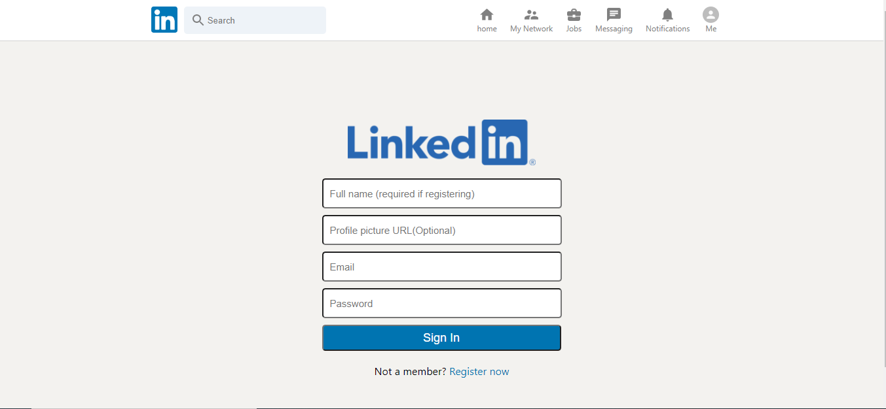

# LinkedIn clone 

>  LinkedIn clone !

## Description

LinkedIn clone is a linkedin clone built with React, Redux, Firebase, Google Auth, React hooks. This clone allows users to login, add posts, view others posts.

## Live version

Heres a live <a href="https://linkedin-764e7.web.app/">link</a>

## Features

LinkedIn   app has the following features
- Create posts.
- View all users posts.
- Firebase auth login.

## Built with

- HTML
- Git
- CSS
- JavaScript
- Shields.io
- Webpack
- npm
- command-line tools such as git.
- React
- create-react-app-buildpack
- Redux
- Firebase
- React Hooks

## Author

Reach out!

👤 **Hillary Kiptoo**

- LinkedIn: [Hillary Kiptoo](https://www.linkedin.com/in/hillarykiptoo)
- Github: [@imhilla](https://github.com/imhilla)
- Twitter: [@hillarykiptoo](https://twitter.com/hillarykiptoo_)

## License

- **[MIT license](http://opensource.org/licenses/mit-license.php)**
